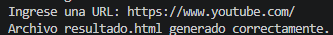
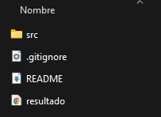
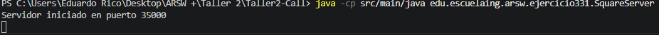
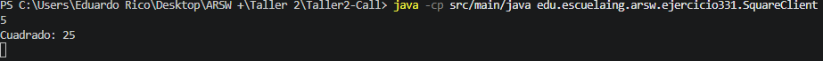
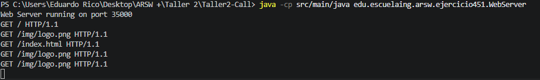
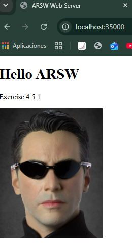
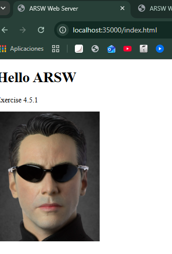
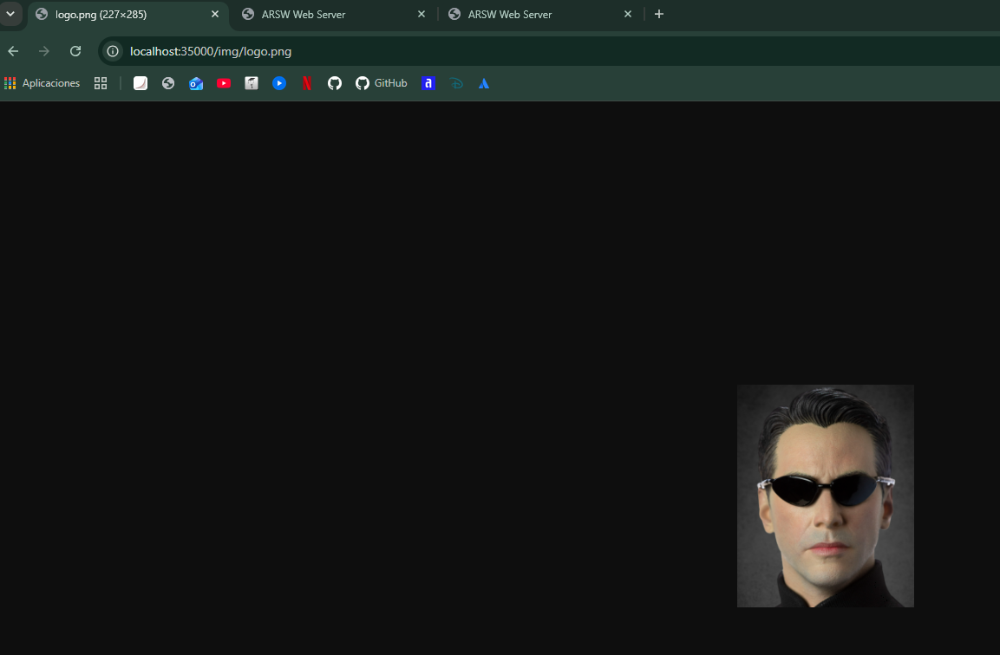

# ARSW - Taller #2 Call

**Author:** Eduardo Rico Duarte 

**Course:** Software Architectures (ARSW)

**Escuela Colombiana de Ingeniería Julio Garavito**

---
# Exercise 1 - URL Components Recognition in Java

## Objective

To understand the structure of a URL and become familiar with the `URL` class from the `java.net` package by identifying and extracting its different components using the methods provided by Java.

---

## Theoretical Background

A URL (*Uniform Resource Locator*) is an address used to locate resources on a network, typically the Internet. A URL is composed of different elements that identify the communication protocol, the server hosting the resource, and the specific location of that resource.

The general structure of a URL is:

```text
<protocol>://<server>:<port>/<path>?<query>#<reference>
```

For example:

```text
http://www.example.com:80/docs/index.html?course=arsw#chapter1
```

The `URL` class from the `java.net` package allows developers to represent a URL and provides methods to access each of its components.

| Method           | Description                                    |
| ---------------- | ---------------------------------------------- |
| `getProtocol()`  | Returns the protocol used by the URL.          |
| `getAuthority()` | Returns the authority section (host and port). |
| `getHost()`      | Returns the host name.                         |
| `getPort()`      | Returns the specified port number.             |
| `getPath()`      | Returns the path of the resource.              |
| `getQuery()`     | Returns the query string.                      |
| `getFile()`      | Returns the path and query string.             |
| `getRef()`       | Returns the reference (fragment) of the URL.   |

---

## Exercise Development

A Java application was implemented to create a `URL` object using a sample web address. The program then invokes each of the methods studied and prints their corresponding values to the console.

### Implemented Code

```java
URL url = new URL(
    "http://www.example.com:80/docs/index.html?course=arsw#chapter1"
);

System.out.println("Protocol: " + url.getProtocol());
System.out.println("Authority: " + url.getAuthority());
System.out.println("Host: " + url.getHost());
System.out.println("Port: " + url.getPort());
System.out.println("Path: " + url.getPath());
System.out.println("Query: " + url.getQuery());
System.out.println("File: " + url.getFile());
System.out.println("Ref: " + url.getRef());
```

---

## Results Analysis

After executing the program, it was observed that each method correctly returns a specific component of the URL.

For example:

* The protocol returned was `http`.
* The host identified was `www.example.com`.
* The port obtained was `80`.
* The resource path was `/docs/index.html`.
* The query string returned was `course=arsw`.
* The reference fragment obtained was `chapter1`.

These results demonstrate that the `URL` class provides an efficient mechanism for decomposing a web address into its fundamental elements, making it easier to process network resources within Java applications.

---

## Evidence

### Program Execution

**Figure 1.** Console output generated by the execution of Exercise 1.

> Insert a screenshot of the program execution here.

```markdown

```

---

## Conclusions

1. The `URL` class from the `java.net` package provides a simple and effective way to manipulate and analyze web addresses.
2. A URL is composed of multiple elements that can be accessed independently through dedicated methods.
3. Understanding the structure of a URL is fundamental for developing client-server applications and distributed systems.
4. This exercise establishes the foundation for subsequent networking activities involving HTTP communication and resource retrieval from the Internet.

---

## References

1. Benavides, L. D., & Gualtero, R. H. (2026). *Introduction to naming schemes, networks, clients, and services with Java* [Laboratory guide]. Escuela Colombiana de Ingeniería Julio Garavito.

2. Benavides, L. D. (2026). *Connectors and Components (C&C) – Call and Return Styles* [Class presentation]. Escuela Colombiana de Ingeniería Julio Garavito.

3. OpenAI. (2026). *ChatGPT (GPT-5.5 version) [Large Language Model]*. https://chatgpt.com/ (Used primarily as a support tool).

4. Oracle. (n.d.). *Custom Networking Tutorial*. Oracle Documentation. https://docs.oracle.com/javase/tutorial/networking/index.html


# Exercise 2 - Reading and Storing Web Page Content

## Objective

To develop a Java application capable of requesting a URL from the user, accessing the content available at that address through network streams, and storing the retrieved information in a local HTML file for later visualization in a web browser.

---

## Theoretical Background

Java provides several networking utilities through the `java.net` package. One of the most commonly used classes is `URL`, which represents the location of a resource on the Internet.

A URL can be used not only to identify a resource but also to access its content. By opening an input stream through the `openStream()` method, Java applications can read data from a remote web server in the same way they read data from a file or from the keyboard.

Streams are a fundamental concept in Java I/O operations. In this exercise:

* `InputStream` is used to receive data from a remote resource.
* `InputStreamReader` converts bytes into characters.
* `BufferedReader` allows efficient line-by-line reading.
* `FileWriter` and `PrintWriter` are used to write the retrieved content into a local file.

This mechanism is the basis of many networked applications such as web browsers, API clients, and distributed systems.

---

## Exercise Development

A Java application was implemented to:

1. Request a URL from the user.
2. Create a `URL` object from the provided address.
3. Open an input stream to access the remote resource.
4. Read the content line by line using a `BufferedReader`.
5. Store the retrieved content into a file named `resultado.html`.
6. Close all resources properly after the operation is completed.

### Implemented Code

```java
Scanner scanner = new Scanner(System.in);

System.out.print("Enter a URL: ");
String direccion = scanner.nextLine();

URL url = new URL(direccion);

BufferedReader reader =
        new BufferedReader(
                new InputStreamReader(url.openStream()));

PrintWriter writer =
        new PrintWriter(
                new FileWriter("resultado.html"));

String linea;

while ((linea = reader.readLine()) != null) {
    writer.println(linea);
}

reader.close();
writer.close();
```

---

## Results Analysis

The application successfully established a connection to the specified web resource, downloaded its HTML content, and stored the information in a local file named `resultado.html`.

During testing, it was observed that:

* Valid URLs produced a correct HTML file containing the page source.
* Invalid URLs generated exceptions such as `MalformedURLException`.
* URLs pointing to non-existent domains generated `UnknownHostException`, indicating that the DNS resolution process failed.

After opening the generated file in a web browser, the downloaded content was rendered correctly, demonstrating that the application successfully retrieved and stored the remote resource.

This exercise illustrates how Java applications can consume information from external web resources using network streams and basic I/O operations.

---

## Evidence

### Program Execution



### Generated HTML File



---

## Conclusions

1. The `URL` class allows Java applications to access resources available on the Internet.
2. Network streams can be processed using the same mechanisms employed for local file input operations.
3. Java's I/O classes provide an efficient way to transfer information from remote resources into local files.
4. Exception handling is essential when working with network resources due to potential issues such as malformed URLs, unavailable servers, or DNS resolution failures.
5. This exercise serves as a foundation for understanding HTTP clients and more advanced client-server communication mechanisms.

---

## References

1. Benavides, L. D., & Gualtero, R. H. (2026). *Introduction to naming schemes, networks, clients, and services with Java* [Laboratory guide]. Escuela Colombiana de Ingeniería Julio Garavito.

2. Benavides, L. D. (2026). *Connectors and Components (C&C) – Call and Return Styles* [Class presentation]. Escuela Colombiana de Ingeniería Julio Garavito.

3. OpenAI. (2026). *ChatGPT (GPT-5.5 version) [Large Language Model]*. https://chatgpt.com/ (Used primarily as a support tool).

4. Oracle. (n.d.). *Custom Networking Tutorial*. Oracle Documentation. https://docs.oracle.com/javase/tutorial/networking/index.html

# Exercise 3.3.1 - Square Number Server Using TCP Sockets

## Objective

To implement a client-server application using TCP sockets in Java, where the client sends a numerical value to the server and the server calculates and returns the square of the received number.

---

## Theoretical Background

Sockets are communication endpoints that enable data exchange between applications running on a network. In Java, socket-based communication is implemented through the classes `Socket` and `ServerSocket` located in the `java.net` package.

The client-server model consists of two main components:

* **Client:** Initiates communication and sends requests.
* **Server:** Waits for incoming connections, processes requests, and sends responses.

TCP (*Transmission Control Protocol*) provides reliable communication by guaranteeing packet delivery and preserving message order. Through TCP sockets, applications can exchange information using input and output streams.

In this exercise, a simple application-level protocol was implemented:

1. The client sends a number.
2. The server computes the square of the number.
3. The server sends the result back to the client.

---

## Exercise Development

Two independent Java applications were developed:

### SquareServer

The server listens on port `35000`, accepts incoming client connections, receives numerical values, calculates their squares, and sends the results back to the client.

### SquareClient

The client establishes a TCP connection with the server, sends a number entered by the user, and displays the response received from the server.

### Communication Flow

```text
Client  ----->  Number
Server  ----->  Square(Number)
```

---

## Execution Commands

### Compilation

```bash
javac src/main/java/edu/escuelaing/arsw/ejercicio331/*.java
```

### Execute the Server

```bash
java -cp src/main/java edu.escuelaing.arsw.ejercicio331.SquareServer
```

### Execute the Client

```bash
java -cp src/main/java edu.escuelaing.arsw.ejercicio331.SquareClient
```

---

## Results Analysis

The server successfully accepted incoming client connections through a TCP socket and processed numerical requests.

During testing:

* The client transmitted integer values correctly.
* The server calculated the square of each received value.
* The calculated result was returned to the client through the established connection.
* Invalid inputs generated appropriate validation responses.

This exercise demonstrates the basic implementation of client-server communication using TCP sockets and illustrates how Java applications can exchange information through network streams.

---

## Evidence

### Server Execution



### Client Execution



---

## Conclusions

1. TCP sockets provide a reliable mechanism for communication between distributed applications.
2. The classes `Socket` and `ServerSocket` simplify the implementation of client-server architectures in Java.
3. Input and output streams can be used to exchange information over network connections.
4. The client-server paradigm forms the basis of many modern distributed systems.
5. This exercise provides a foundation for developing more advanced network services and communication protocols.

---

## References

1. Benavides, L. D., & Gualtero, R. H. (2026). *Introduction to naming schemes, networks, clients, and services with Java* [Laboratory guide]. Escuela Colombiana de Ingeniería Julio Garavito.

2. Benavides, L. D. (2026). *Connectors and Components (C&C) – Call and Return Styles* [Class presentation]. Escuela Colombiana de Ingeniería Julio Garavito.

3. OpenAI. (2026). *ChatGPT (GPT-5.5 version) [Large Language Model]*. https://chatgpt.com/ (Used primarily as a support tool).

4. Oracle. (n.d.). *Custom Networking Tutorial*. Oracle Documentation. https://docs.oracle.com/javase/tutorial/networking/index.html

# Exercise 3.3.2 - Trigonometric Function Server Using TCP Sockets

## Objective

To implement a stateful client-server application using TCP sockets in Java, where the server performs trigonometric operations on received numerical values and allows the client to dynamically change the active mathematical function through commands.

---

## Theoretical Background

This exercise extends the concepts introduced in Exercise 3.3.1 regarding TCP socket communication and the client-server architecture.

The main difference is that the server now maintains an internal state represented by the currently selected trigonometric function (`cos`, `sin`, or `tan`).

Additionally, a simple application-level protocol was introduced. Besides numerical values, the client can send commands in the form:

```text
fun:sin
fun:cos
fun:tan
```

These commands modify the server's behavior without restarting the connection, demonstrating how communication protocols can be built on top of TCP sockets.

---

## Exercise Development

Two applications were implemented:

### TrigonometricServer

The server listens on port `35000`, receives commands or numerical values, maintains the currently selected trigonometric function, and returns the corresponding result.

The default operation is:

```text
cos(x)
```

Supported commands:

```text
fun:sin
fun:cos
fun:tan
```

### TrigonometricClient

The client establishes a TCP connection with the server and allows users to send either commands or numerical values through the console.

### Communication Flow

```text
Client -----> fun:sin
Server -----> Function changed to: sin

Client -----> 0
Server -----> 0.0
```

---

## Execution Commands

### Compilation

```bash
javac src/main/java/edu/escuelaing/arsw/ejercicio432/*.java
```

### Execute the Server

```bash
java -cp src/main/java edu.escuelaing.arsw.ejercicio432.TrigonometricServer
```

### Execute the Client

```bash
java -cp src/main/java edu.escuelaing.arsw.ejercicio432.TrigonometricClient
```

---

## Results Analysis

The server successfully processed two different types of requests:

1. Function change commands.
2. Numerical values for computation.

The active function remained stored throughout the execution, allowing multiple requests to be evaluated using the same operation until a new command was received.

The tests confirmed that:

* The server correctly calculated cosine values by default.
* The active function changed when receiving valid commands.
* Subsequent calculations used the updated function.
* Invalid commands and invalid numerical inputs were handled appropriately.

This exercise demonstrates how state can be maintained in a client-server application and how custom communication protocols can be implemented on top of TCP sockets.

---

## Evidence

### Server Execution


### Client Execution


---

## Conclusions

1. TCP sockets can be used to implement custom communication protocols between distributed applications.
2. A server can maintain internal state information across multiple client requests.
3. Application-level commands allow dynamic modification of server behavior without restarting the connection.
4. This approach resembles the request-response mechanisms used by modern web services and distributed systems.
5. The exercise demonstrates the transition from simple data exchange to protocol-driven communication.

---

## References

1. Benavides, L. D., & Gualtero, R. H. (2026). *Introduction to naming schemes, networks, clients, and services with Java* [Laboratory guide]. Escuela Colombiana de Ingeniería Julio Garavito.

2. Benavides, L. D. (2026). *Connectors and Components (C&C) – Call and Return Styles* [Class presentation]. Escuela Colombiana de Ingeniería Julio Garavito.

3. OpenAI. (2026). *ChatGPT (GPT-5.5 version) [Large Language Model]*. https://chatgpt.com/ (Used primarily as a support tool).

4. Oracle. (n.d.). *Custom Networking Tutorial*. Oracle Documentation. https://docs.oracle.com/javase/tutorial/networking/index.html


# Exercise 4.5.1 - Sequential Web Server

## Objective

To implement a web server in Java capable of handling multiple sequential HTTP requests, serving static resources such as HTML pages and images requested by a web browser.

---

## Theoretical Background

This exercise builds upon the TCP socket concepts introduced in previous exercises and extends them to the HTTP protocol.

HTTP (HyperText Transfer Protocol) is the communication protocol used between web browsers and web servers. A client sends an HTTP request, and the server responds with the requested resource and the corresponding HTTP headers.

A web server typically performs the following tasks:

1. Listens for incoming connections on a specific port.
2. Receives and interprets HTTP requests.
3. Locates the requested resource.
4. Generates an HTTP response.
5. Sends the requested content to the client.

Unlike the previous exercises, this server must remain active and process multiple requests sequentially, allowing users to navigate between different resources without restarting the application.

---

## Exercise Development

A web server was implemented using the classes `ServerSocket` and `Socket`.

The server listens on port `35000` and continuously waits for incoming requests using a loop.

When a request is received, the server:

1. Extracts the requested path from the HTTP request line.
2. Searches for the corresponding file in the resources directory.
3. Determines the content type of the file.
4. Generates the appropriate HTTP headers.
5. Sends the requested file to the browser.

The server supports:

* HTML files (`.html`)
* PNG images (`.png`)
* JPG/JPEG images (`.jpg`, `.jpeg`)
* Other static resources supported by the operating system MIME detection.

### Request Flow

```text
Browser
   |
   | GET /index.html
   |
Web Server
   |
   +--> Locate file
   |
   +--> Generate HTTP response
   |
   +--> Send content
```

---

## Execution Commands

### Compilation

```bash
javac src/main/java/edu/escuelaing/arsw/ejercicio451/WebServer.java
```

### Execute the Server

```bash
java -cp src/main/java edu.escuelaing.arsw.ejercicio451.WebServer
```

### Access from Browser

```text
http://localhost:35000
```

Examples:

```text
http://localhost:35000/index.html
http://localhost:35000/img/logo.png
```

---

## Results Analysis

The implemented server successfully handled multiple consecutive HTTP requests without requiring a restart.

During testing, the browser correctly requested and displayed:

* HTML pages.
* PNG images.
* Additional static resources.

The server correctly generated HTTP responses with the appropriate headers, including content type and content length information.

This exercise demonstrates the relationship between TCP sockets and the HTTP protocol and provides a simplified implementation of the basic behavior of modern web servers.

---

## Evidence

### Server Execution




### Browser Access





### Image Delivery



---

## Conclusions

1. HTTP communication can be implemented directly on top of TCP sockets.
2. A web server is responsible for interpreting requests and generating valid HTTP responses.
3. Static resources such as HTML files and images can be served through custom Java applications.
4. Sequential request handling allows a server to remain active and process multiple browser requests.
5. This exercise provides the foundation for understanding the architecture of modern web servers and web applications.


