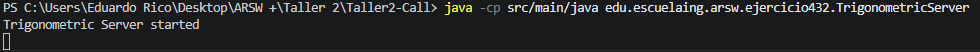
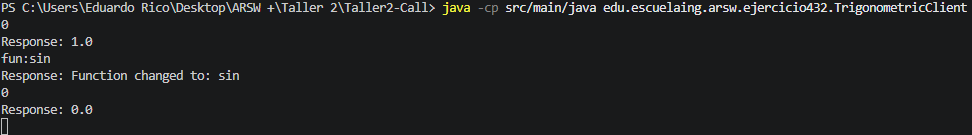

# Ejercicio 3.3.2 - Servidor de Funciones Trigonométricas usando Sockets TCP

## Objetivo

Implementar una aplicación cliente-servidor con sockets TCP en Java, donde el servidor realice operaciones trigonométricas sobre valores numéricos recibidos y permita cambiar dinámicamente la función matemática activa mediante comandos enviados por el cliente.

---

## Marco Teórico

Este ejercicio amplía los conceptos introducidos en el Ejercicio 3.3.1 relacionados con la comunicación mediante sockets TCP y la arquitectura cliente-servidor.

La principal diferencia es que el servidor mantiene un estado interno representado por la función trigonométrica actualmente seleccionada (`cos`, `sin` o `tan`).

Además, se implementó un protocolo de aplicación simple. Además de enviar números, el cliente puede enviar comandos con la estructura:

```text
fun:sin
fun:cos
fun:tan
```

Estos comandos modifican el comportamiento del servidor sin necesidad de reiniciar la conexión, demostrando cómo es posible construir protocolos de comunicación sobre TCP.

---

## Desarrollo del Ejercicio

Se desarrollaron dos aplicaciones:

### TrigonometricServer

El servidor escucha en el puerto `35000`, recibe comandos o valores numéricos, mantiene la función trigonométrica activa y retorna el resultado correspondiente.

La función inicial es:

```text
cos(x)
```

Comandos soportados:

```text
fun:sin
fun:cos
fun:tan
```

### TrigonometricClient

El cliente establece una conexión TCP con el servidor y permite enviar desde consola tanto comandos como valores numéricos.

### Flujo de Comunicación

```text
Cliente -----> fun:sin
Servidor -----> Function changed to: sin

Cliente -----> 0
Servidor -----> 0.0
```

---

## Comandos de Ejecución

### Compilación

```bash
javac src/main/java/edu/escuelaing/arsw/ejercicio432/*.java
```

### Ejecutar el Servidor

```bash
java -cp src/main/java edu.escuelaing.arsw.ejercicio432.TrigonometricServer
```

### Ejecutar el Cliente

```bash
java -cp src/main/java edu.escuelaing.arsw.ejercicio432.TrigonometricClient
```

---

## Análisis de Resultados

El servidor logró procesar correctamente dos tipos de solicitudes:

1. Comandos de cambio de función.
2. Valores numéricos para cálculo.

La función activa permaneció almacenada durante toda la ejecución, permitiendo evaluar múltiples solicitudes con la misma operación hasta recibir una nueva instrucción.

Las pruebas realizadas confirmaron que:

* El servidor calculó correctamente cosenos por defecto.
* La función activa cambió al recibir comandos válidos.
* Los cálculos posteriores utilizaron la nueva función seleccionada.
* Las entradas inválidas fueron gestionadas adecuadamente.

Este ejercicio demuestra cómo una aplicación cliente-servidor puede mantener estado y cómo es posible implementar protocolos de comunicación personalizados sobre sockets TCP.

---

## Evidencias

### Ejecución del Servidor



### Ejecución del Cliente



---

## Conclusiones

1. Los sockets TCP permiten implementar protocolos de comunicación personalizados entre aplicaciones distribuidas.
2. Un servidor puede mantener información de estado entre múltiples solicitudes del cliente.
3. Los comandos de aplicación permiten modificar dinámicamente el comportamiento del servidor sin reiniciar la conexión.
4. Este enfoque es similar a los mecanismos de petición-respuesta utilizados por servicios web modernos.
5. El ejercicio representa una evolución desde el simple intercambio de datos hacia protocolos de comunicación más elaborados.

---

## Bibliografía

1. Benavides, L. D., & Gualtero, R. H. (2026). *Introducción a esquemas de nombres, redes, clientes y servicios con Java* [Guía de laboratorio]. Escuela Colombiana de Ingeniería Julio Garavito.

2. Benavides, L. D. (2026). *Connectors and Components (C&C) – Call and Return Styles* [Presentación de clase]. Escuela Colombiana de Ingeniería Julio Garavito.

3. OpenAI. (2026). *ChatGPT (GPT-5.5 version) [Large Language Model]*. https://chatgpt.com/ (Used primarily as a support tool).

4. Oracle. (s.f.). *Custom Networking Tutorial*. Oracle Documentation. https://docs.oracle.com/javase/tutorial/networking/index.html
