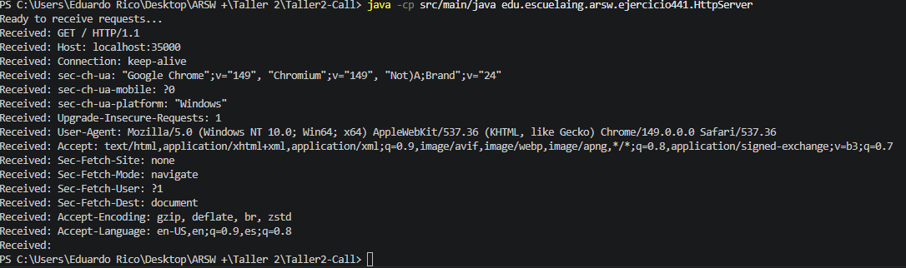
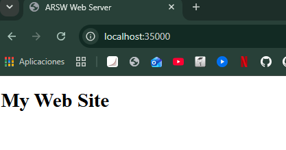

# Ejercicio 4.4 - Servidor Web de una Solicitud

## Objetivo

Implementar un servidor web básico en Java capaz de recibir una solicitud desde un navegador y responder con una página HTML sencilla.

---

## Marco Teórico

Este ejercicio introduce el concepto de servidor web construido sobre sockets TCP.

El servidor escucha una solicitud HTTP proveniente del navegador, procesa la petición recibida y retorna una respuesta HTML. A diferencia del ejercicio 4.5.1, esta implementación atiende únicamente una solicitud antes de finalizar su ejecución.

---

## Desarrollo del Ejercicio

Se implementó un servidor web simple utilizando las clases `ServerSocket` y `Socket`.

El servidor realiza las siguientes acciones:

1. Escucha conexiones en el puerto `35000`.
2. Espera una conexión proveniente de un navegador.
3. Recibe e imprime en consola los encabezados de la solicitud HTTP.
4. Genera una respuesta HTML básica.
5. Envía la respuesta al navegador.
6. Finaliza su ejecución después de atender la solicitud.

La página generada contiene el mensaje:

```html
<h1>My Web Site</h1>
```

---

## Comandos de Ejecución

### Compilación

```bash
javac src/main/java/edu/escuelaing/arsw/ejercicio441/HttpServer.java
```

### Ejecutar el Servidor

```bash
java -cp src/main/java edu.escuelaing.arsw.ejercicio441.HttpServer
```

### Acceso desde el Navegador

```text
http://localhost:35000
```

---

## Análisis de Resultados

El servidor aceptó correctamente una conexión proveniente del navegador y mostró en consola la solicitud HTTP recibida.

Posteriormente generó una respuesta HTML válida que fue interpretada y mostrada correctamente por el navegador.

Este ejercicio permite comprender el funcionamiento básico de la comunicación entre un navegador y un servidor web mediante el protocolo HTTP.

---

## Evidencias

### Ejecución del Servidor



### Respuesta en el Navegador



---

## Conclusiones

1. Las solicitudes HTTP pueden recibirse y procesarse directamente utilizando sockets TCP.
2. Un servidor web puede generar respuestas HTML que son interpretadas por los navegadores.
3. El ejercicio ilustra el modelo básico de petición-respuesta utilizado por las aplicaciones web.
4. Esta implementación constituye la base para servidores más avanzados capaces de atender múltiples solicitudes y servir diferentes recursos.

---

## Bibliografía

1. Benavides, L. D., & Gualtero, R. H. (2026). *Introducción a esquemas de nombres, redes, clientes y servicios con Java* [Guía de laboratorio]. Escuela Colombiana de Ingeniería Julio Garavito.

2. Benavides, L. D. (2026). *Connectors and Components (C&C) – Call and Return Styles* [Presentación de clase]. Escuela Colombiana de Ingeniería Julio Garavito.

3. OpenAI. (2026). *ChatGPT (GPT-5.5 version) [Large Language Model]*. https://chatgpt.com/ (Used primarily as a support tool).

4. Oracle. (s.f.). *Custom Networking Tutorial*. Oracle Documentation. https://docs.oracle.com/javase/tutorial/networking/index.html
