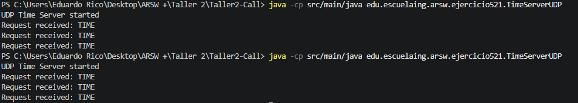
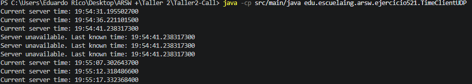

# Ejercicio 5.2.1 - Servicio de Hora mediante UDP

## Objetivo

Implementar una aplicación cliente-servidor utilizando datagramas UDP en Java, donde el servidor proporcione la hora actual del sistema y el cliente actualice dicha información cada cinco segundos, manteniéndose operativo incluso cuando el servidor se encuentre temporalmente fuera de servicio.

---

## Marco Teórico

A diferencia de TCP, que establece una conexión confiable entre dos aplicaciones, UDP (*User Datagram Protocol*) es un protocolo sin conexión que envía mensajes independientes llamados datagramas.

UDP no garantiza:

* La entrega de los mensajes.
* El orden de llegada.
* La recuperación ante errores.

Sin embargo, ofrece una comunicación más ligera y rápida, siendo adecuado para aplicaciones donde la pérdida ocasional de información es aceptable, como transmisiones en tiempo real, videojuegos en línea, monitoreo de sistemas y actualizaciones periódicas de estado.

En Java, la comunicación UDP se implementa mediante las clases:

* `DatagramSocket`
* `DatagramPacket`

El cliente envía un datagrama a una dirección y puerto específicos, y el servidor responde mediante otro datagrama sin establecer una conexión permanente.

---

## Desarrollo del Ejercicio

Se implementaron dos aplicaciones:

### TimeServerUDP

El servidor escucha en el puerto `45000` esperando solicitudes de los clientes.

Cuando recibe una petición, obtiene la hora actual del sistema y la envía de regreso al cliente.

### TimeClientUDP

El cliente envía una solicitud cada cinco segundos preguntando por la hora actual.

Para evitar bloqueos indefinidos, se configuró un tiempo máximo de espera (*timeout*) sobre el socket UDP.

Cuando el servidor responde correctamente, la hora mostrada se actualiza.

Si no se recibe respuesta, el cliente conserva la última hora conocida y continúa ejecutándose hasta que el servidor vuelva a estar disponible.

### Flujo de Comunicación

```text
Cliente -----> TIME
Servidor -----> Hora Actual

Cliente -----> TIME
Servidor apagado

Cliente -----> TIME
Servidor -----> Hora Actual
```

---

## Comandos de Ejecución

### Compilación

```bash
javac src/main/java/edu/escuelaing/arsw/ejercicio521/*.java
```

### Ejecutar el Servidor

```bash
java -cp src/main/java edu.escuelaing.arsw.ejercicio521.TimeServerUDP
```

### Ejecutar el Cliente

```bash
java -cp src/main/java edu.escuelaing.arsw.ejercicio521.TimeClientUDP
```

---

## Análisis de Resultados

La solución implementada permitió establecer una comunicación exitosa mediante UDP entre cliente y servidor.

El cliente solicitó periódicamente la hora cada cinco segundos y actualizó la información mostrada cuando recibió respuesta del servidor.

Durante las pruebas, el servidor fue detenido y reiniciado manualmente. El cliente continuó funcionando correctamente, mostrando la última hora conocida mientras el servidor permaneció fuera de servicio y actualizando nuevamente la información cuando este volvió a estar disponible.

Este comportamiento evidencia la naturaleza no orientada a conexión de UDP y la necesidad de manejar adecuadamente la ausencia de respuestas.

---

## Evidencias

### Ejecución del Servidor




### Cliente Actualizando la Hora



---

## Conclusiones

1. UDP permite la comunicación entre aplicaciones sin necesidad de establecer conexiones persistentes.
2. La comunicación basada en datagramas implica la posibilidad de pérdida de mensajes, por lo que es necesario implementar mecanismos de espera y recuperación.
3. El cliente desarrollado toleró correctamente la caída temporal del servidor sin requerir reinicio.
4. UDP es apropiado para escenarios donde la rapidez y simplicidad son más importantes que la confiabilidad absoluta.
5. El ejercicio introduce conceptos fundamentales utilizados en sistemas distribuidos, monitoreo y servicios en tiempo real.

---

## Bibliografía

1. Benavides, L. D., & Gualtero, R. H. (2026). *Introducción a esquemas de nombres, redes, clientes y servicios con Java* [Guía de laboratorio]. Escuela Colombiana de Ingeniería Julio Garavito.

2. Benavides, L. D. (2026). *Connectors and Components (C&C) – Call and Return Styles* [Presentación de clase]. Escuela Colombiana de Ingeniería Julio Garavito.

3. OpenAI. (2026). *ChatGPT (GPT-5.5 version) [Large Language Model]*. https://chatgpt.com/ (Used primarily as a support tool).

4. Oracle. (s.f.). *Custom Networking Tutorial*. Oracle Documentation. https://docs.oracle.com/javase/tutorial/networking/index.html
