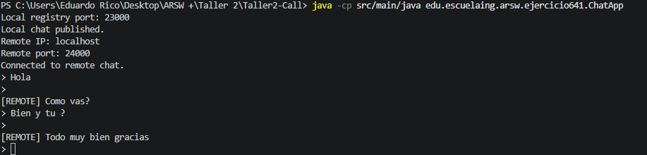
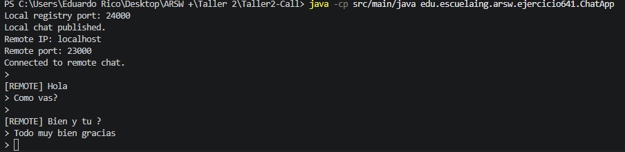

# Ejercicio 6.4.1 - Chat Distribuido utilizando Java RMI

## Objetivo

Implementar una aplicación de chat distribuido utilizando Java RMI (Remote Method Invocation), permitiendo que dos aplicaciones ejecutadas en diferentes procesos o máquinas se comuniquen mediante la invocación remota de métodos.

---

## Marco Teórico

RMI (*Remote Method Invocation*) es una tecnología de Java que permite que un objeto ubicado en una Máquina Virtual de Java (JVM) invoque métodos sobre otro objeto que se encuentra en una JVM diferente, incluso en otra máquina.

La arquitectura RMI se basa en:

* **Interfaces remotas**, que definen los métodos accesibles remotamente.
* **Objetos remotos**, que implementan dichas interfaces.
* **RMI Registry**, encargado de publicar y localizar objetos remotos mediante nombres.
* **Stubs y Skeletons**, que abstraen los detalles de comunicación entre aplicaciones distribuidas.

A diferencia de la comunicación mediante sockets, RMI permite desarrollar aplicaciones distribuidas utilizando directamente conceptos orientados a objetos.

---

## Desarrollo del Ejercicio

Se implementó una aplicación de chat punto a punto utilizando Java RMI.

Cada instancia de la aplicación funciona simultáneamente como:

* **Servidor**, publicando un objeto remoto que recibe mensajes.
* **Cliente**, conectándose a otro objeto remoto para enviar mensajes.

Al iniciar la aplicación se solicitan los siguientes datos:

1. Puerto local donde se creará el RMI Registry.
2. Dirección IP del aplicativo remoto.
3. Puerto remoto donde se encuentra publicado el otro Registry.

Una vez establecida la conexión, ambos aplicativos pueden intercambiar mensajes mediante llamadas remotas a métodos.

### Componentes Implementados

#### ChatRemote

Interfaz remota que define el método:

```java
void receiveMessage(String message)
```

#### ChatRemoteImpl

Implementación del objeto remoto encargada de recibir y mostrar mensajes entrantes.

#### ChatApp

Aplicación principal encargada de:

* Crear el Registry local.
* Publicar el objeto remoto.
* Conectarse al Registry remoto.
* Obtener la referencia remota.
* Enviar mensajes mediante invocaciones remotas.

### Flujo de Comunicación

```text
Aplicación A
      |
receiveMessage()
      |
      V
Aplicación B

Aplicación B
      |
receiveMessage()
      |
      V
Aplicación A
```

---

## Comandos de Ejecución

### Compilación

```bash
javac src/main/java/edu/escuelaing/arsw/ejercicio641/*.java
```

### Ejecutar Primera Instancia

```bash
java -cp src/main/java edu.escuelaing.arsw.ejercicio641.ChatApp
```

Ejemplo:

```text
Local registry port: 23000
Remote IP: localhost
Remote port: 24000
```

### Ejecutar Segunda Instancia

```bash
java -cp src/main/java edu.escuelaing.arsw.ejercicio641.ChatApp
```

Ejemplo:

```text
Local registry port: 24000
Remote IP: localhost
Remote port: 23000
```

---

## Análisis de Resultados

La aplicación desarrollada logró establecer comunicación entre dos procesos distribuidos mediante Java RMI.

Cada instancia publicó exitosamente un objeto remoto y consumió servicios remotos proporcionados por la otra instancia.

Los mensajes enviados fueron recibidos y mostrados de manera inmediata utilizando invocaciones remotas de métodos, sin necesidad de manejar explícitamente protocolos de red de bajo nivel.

La solución evidencia cómo RMI facilita el desarrollo de aplicaciones distribuidas utilizando directamente el paradigma orientado a objetos.

---

## Evidencias

### Primera Instancia del Chat



### Segunda Instancia del Chat




---

## Conclusiones

1. Java RMI permite la comunicación entre objetos distribuidos utilizando un modelo orientado a objetos.
2. Las interfaces remotas definen claramente los servicios que pueden ser invocados desde otras aplicaciones.
3. El servicio RMI Registry facilita la publicación y localización dinámica de objetos remotos.
4. Una misma aplicación puede desempeñar simultáneamente el rol de cliente y servidor.
5. El ejercicio introduce conceptos fundamentales utilizados en sistemas distribuidos, arquitecturas orientadas a servicios y middleware.

---

## Bibliografía

1. Benavides, L. D., & Gualtero, R. H. (2026). *Introducción a esquemas de nombres, redes, clientes y servicios con Java* [Guía de laboratorio]. Escuela Colombiana de Ingeniería Julio Garavito.

2. Benavides, L. D. (2026). *Connectors and Components (C&C) – Call and Return Styles* [Presentación de clase]. Escuela Colombiana de Ingeniería Julio Garavito.

3. OpenAI. (2026). *ChatGPT (GPT-5.5 version) [Large Language Model]*. https://chatgpt.com/ (Used primarily as a support tool).

4. Oracle. (s.f.). *Java RMI Tutorial*. Oracle Documentation. https://docs.oracle.com/javase/tutorial/rmi/
